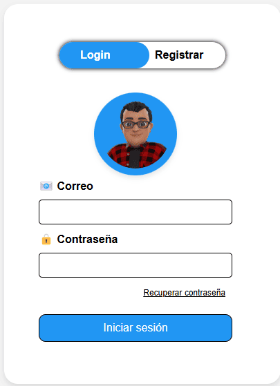
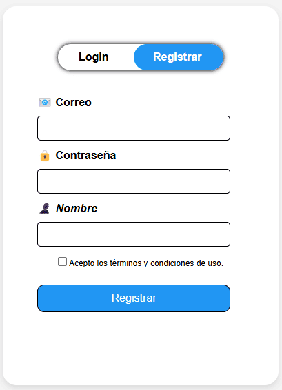

# Autenticación Segura Mediante E-Mail

La práctica de **"Autenticación Segura Mediante E-Mail"** es una solución diseñada para gestionar el acceso de usuarios a una plataforma web de forma segura y confiable. Esta práctica utiliza tecnologías como PHP, MySQL y Recaptcha para garantizar la autenticación de usuarios de manera efectiva.

<p align="center">
  
</p>

La interfaz de usuario proporciona dos opciones principales: iniciar sesión o registrarse como nuevo usuario. Cada opción está claramente presentada con botones de navegación que permiten cambiar entre los formularios de inicio de sesión y registro. Los elementos visuales, como el logotipo y los campos de entrada, están cuidadosamente diseñados para proporcionar una experiencia de usuario intuitiva y atractiva.

<p align="center">
  
</p>

En el formulario de inicio de sesión, los usuarios deben ingresar su correo electrónico y contraseña. Además, se incluye un Recaptcha para verificar que el acceso está siendo realizado por un humano legítimo y no por un programa automatizado. Esto añade una capa adicional de seguridad para prevenir ataques de fuerza bruta y bots maliciosos.

En caso de olvido de contraseña, se proporciona un mecanismo de recuperación que solicita al usuario ingresar su correo electrónico registrado. Una vez enviado, el sistema enviará un correo electrónico con la contraseña correspondiente, manteniendo así la seguridad y privacidad de los datos del usuario.

El proceso de registro requiere que los usuarios proporcionen su correo electrónico, contraseña y nombre. Se incluye una opción para aceptar los términos y condiciones de uso antes de completar el registro. Si el correo electrónico proporcionado ya está registrado, se muestra un mensaje de error para informar al usuario y evitar duplicados en la base de datos.

La práctica de **"Autenticación Segura Mediante E-Mail"** ofrece una solución robusta para la gestión segura de accesos de usuarios en aplicaciones web. Al integrar tecnologías como PHP, MySQL y Recaptcha, esta práctica garantiza la autenticación efectiva de usuarios, protegiendo así la privacidad y seguridad de los datos del usuario. Su implementación cuidadosamente diseñada y su enfoque en la seguridad hacen de esta práctica una adición valiosa a cualquier proyecto web que requiera autenticación de usuarios confiable.

**Consulta la versión preliminar de la practica aquí:** [https://practica_12.com](https://www.alejandrovillegas.dev/projects/practice-12/index.html)

# 📌 Información de la Practica

Esta practica ha sido desarrollado como parte del portafolio de soluciones tecnológicas, con el objetivo de ofrecer una herramienta eficiente y funcional para usuarios autodidactas interesados en la gestión y desarrollo de proyectos web.

- **Área**: Desarrollo de Practicas Web

- **Usuario Final**: TecNM

- **Fecha de Desarrollo**: 10 de diciembre de 2018

- **Portafolio de Proyectos**: [www.alejandrovillegas.dev](https://www.alejandrovillegas.dev)

# Guía de Instalación y Configuración

## 🖥️ Requisitos del Sistema

Para ejecutar esta practica de manera local, es necesario contar con un entorno de desarrollo que incluya Apache, MySQL y PHP. Se recomienda el uso de **XAMPP**, ya que fue el entorno con el que se desarrolló la practica. Sin embargo, también es compatible con:

- **XAMPP** (Windows, macOS, Linux)

- **WAMP** (Windows)

- **MAMP** (macOS, Windows)

- **LAMP** (Linux)

## 🔧 Instalación y Configuración de la Practica

Siga los pasos según el entorno de desarrollo que esté utilizando:

### Para XAMPP (Recomendado)

1. Descargue y descomprima el archivo de la practica en su sistema local.

2. Copie la carpeta de la practica y colóquela en el directorio **_htdocs_** dentro de la carpeta de instalación de XAMPP (Ejemplo: **C:\xampp\htdocs\mi_practica**).

### Para WAMP

1. Descargue y descomprima el archivo de la practica.

2. Copie la carpeta de la practica y colóquela en el directorio **_www_** dentro de la carpeta de instalación de WAMP (Ejemplo: **C:\wamp64\www\mi_practica**).

### Para MAMP

1. Descargue y descomprima el archivo de la practica.

2. Copie la carpeta de la practica y colóquela en el directorio **_htdocs_** dentro de la carpeta de instalación de MAMP (Ejemplo: **/Applications/MAMP/htdocs/mi_practica**).

### Para LAMP

1. Descargue y descomprima el archivo de la practica.

2. Mueva la carpeta de la practica a **_/var/www/html/_** utilizando el siguiente comando en la terminal:

```
sudo mv mi_practica /var/www/html/
```

## 🗄️ Configuración de la Base de Datos

### Para XAMPP, WAMP y MAMP

1. Inicie su entorno de desarrollo y asegúrese de que **Apache** y **MySQL** estén en ejecución.

2. Abra su navegador y acceda a **_phpMyAdmin_** ingresando:

- **XAMPP**: http://localhost/phpmyadmin

- **WAMP**: http://localhost/phpmyadmin

- **MAMP**: http://localhost:8888/phpmyadmin

3. Diríjase a la pestaña **SQL** e ingrese el siguiente código para crear la base de datos:

```
CREATE DATABASE General;
```

4. Vaya a la pestaña Importar y seleccione el archivo **_DataBase.sql_** del repositorio para importar la estructura y los datos.

### Para LAMP

1. Abra la terminal y acceda a MySQL con:

```
mysql -u root -p
```

2. Cree la base de datos ejecutando:

```
CREATE DATABASE General;
```

3. Salga de MySQL y luego importe la base de datos con:

```
mysql -u root -p General < /ruta/del/archivo/DataBase.sql
```

Reemplace **_/ruta/del/archivo/_** con la ubicación real del archivo en su sistema.

## 🚀 Ejecución de la Practica

1. Inicie su entorno de desarrollo:

- **XAMPP**: Abra el "Panel de Control de XAMPP" y active **Apache** y **MySQL**.

- **WAMP**: Haga clic en el icono de WAMP y active los servicios.

- **MAMP**: Abra MAMP y haga clic en **Start Servers**.

- **LAMP**: Ejecute los siguientes comandos en la terminal:

```
sudo systemctl start apache2
sudo systemctl start mysql
```

2. Abra un navegador e ingrese la siguiente URL según el entorno:

- **XAMPP / WAMP**: **_http://localhost/_**

- **MAMP**: **_http://localhost:8888/_**

- **LAMP**: **_http://localhost/_**

La practica ahora está funcionando en su entorno local. 🎉

## 🔑 Credenciales de Acceso

### 👤 Detalles de Inicio de Sesión para Usuario Preregistrado

- Nombre de usuario: **_contacto@alejandrovillegas.net_**

- Contraseña: **_12345_**

Tambien puede **registrar un nuevo usuario** desde la interfaz de la aplicación.
